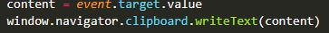

# Webengage Assignment for Implementation Engineer

<h1>Assignment 1</h1>

I created the PopUp Animation by basics of HTML,CSS and JS

  

  

For copying code i used the below code.

  

  

It copies the value of the button and wite it to the clipboard. We can add the copied code to the text box

<h1>Assignment 2</h1>

Nunjucks => A Javascript Template Engine

A rich high performance Javascript templating language supported by all modern browsers</div.

I got an opputunity to learn Nunjucks

  
 I used Basic Looping functionalities and conditional rendering in the given data object

Thanks to Webengage for giving this assignment

